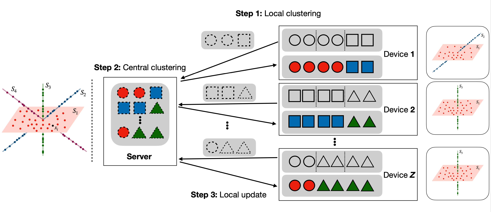

# Fed-SC: One-shot Federated Subspace Clustering



Fed-SC is an one-shot federated scheme for subspace clustering, which conducts subspace learning algorithm in client devices and runs SSC or TSC at central server. It owns several advantages highlighted as follows,

* **Communication efficiency:** Fed-SC just needs one round communication, i.e., each device upload the generated samples to the central server and the server deliver the cluster assignments for local updating to obtain the final clustering.

* **Scalability:** The sequential and parallel running times of Fed-SC achieve reductions from $O(N^2Z^2)$ to $O(ZN^2+O^2)$ and $O(N^2+O^2)$, respectively.

* **Robustness:** Owing to the robustness of SSC and TSC implemented at the central server together with our generically designed cluster encoding and sampling procedures, Fed-SC can exhibit great robustness against communication noise and attacks.

* **Theoretical guarantees:** The final clustering is theoretically guaranteed under broad conditions on data distribution and subspace affinity.

## Installation

```shell
git clone https://github.com/SongjieXie/Fed-SC.git
```

## Dependencies

This project is compatible with the packages:

* pytorch 1.10.0

* torchvision 0.2.2

* numpy 1.21.3

* scikit-learn 1.0.1

* kymatio 0.2.1

* spams 2.6.2.5

where [SPAMS](http://thoth.inrialpes.fr/people/mairal/spams/) is used to efficiently solve the optimization problem of SSC and LASSO version of SSC. The packages kymatio and torchvision are used to pre-process the image data, i.e., COIL100 and EMNIST. 

The project can be run on the synthetic and real-world datasets such as [EMNIST](https://www.nist.gov/itl/products-and-services/emnist-dataset) and [COIL100](https://www.cs.columbia.edu/CAVE/software/softlib/coil-100.php). One can download the datasets in a directory (e.g., `./data/`) and change the root parameter in `data_setup/mydatsets.py`, e.g.,

```python
root = r'./data/'
```

## Examples

There two different implementations of Fed-SC, where the SSC or TSC is conducted at central server, denoted as Fed-SC (SSC) and Fed-SC (TSC), respectively. For Fed-SC (SSC) and Fed-SC (TSC),

```python
from model.SCs import SSC, TSC
from model.fed_sc import fed_sc

# Generate synthetic data from a union of subspaces in an ambient space.
L = distribute_syn(400, 20, [6,9], 20, 50, [4,6], noise=0.0)

# Subspace clustering algorithms
local_SSC = SSC()
central_SSC = SSC(n_cluster=20)
central_TSC = TSC(n_cluster=20, q=6)

# Fed-SC (SSC)
predicted_labs_1, taps_1 = fed_sc(local_SSC, central_SSC, L)

# Fed-SC (TSC)
predicted_labs_2, taps_2 = fed_sc(local_SSC, central_TSC, L)
```

#### Demo on synthetic datasets

```shell
python demo.py -d syn --method FedSC-SSC --num_clients 500 --subspace_dim 6,8 --range_localK 4,6
```

#### Demo on EMNIST dataset

```shell
python demo.py -d EMNIST --method FedSC-SSC --localK 8 --fixed_dim 1 --num_subspaces 62
```

#### Demo on COIL100 dataset

```shell
python demo.py -d COIL100 --method FedSC-SSC --localK 8 --fixed_dim 1 --num_subspaces 100
```

## Update
